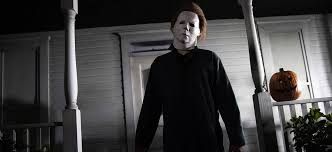
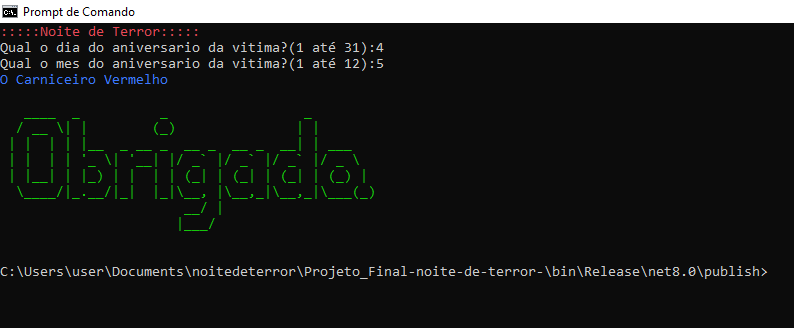
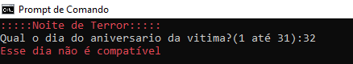
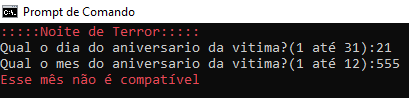

# 🕸🕷 Noite de terror 🕷🕸
Em uma noite de terror, os monstros buscam suas vítimas após ouvir o chamado das estrelas.

Descubra qual o mostro que perseguirá a vítima de acordo com uma data de nascimento e a tabela abaixo.



### Nome - Mês de nascimento

1. Janeiro - O Zumbi

2. Fevereiro -	O Assassino

3. Março -	O Psicopata

4. Abril -	O Palhaço

5. Maio -	O Carniceiro

6. Junho -	O Matador

7. Julho -	O Vampiro

8. bAgosto - O Maluco

9. Setembro -	O Vingador

10. Outubro	- O Monstro

11. Novembro  -	O Bruxo

12. Dezembro  -	O Demônio

### Sobrenome - Dia do nascimento

1.	Endiabrado

2.	Radioativo

3.	Endemoniado

4.	Vermelho

5.	Possuído

6.	Macabro

7.	Sombrio

8.	Sem Cabeça

9.	Desconhecido

10.	Inconsciente

11.	Oculto

12.	Esquecido

13.	Lúgubre

14.	Invocado

15.	Caído

16.	Costurado

17.	Amaldiçoado

18.	Anormal

19.	Perturbado

20.	Sanguinário

21.	Tenebroso

22.	Imortal

23.	Ressuscitado

24.	do Pântano

25.	da Encruzilhada

26.	do Porão

27.	do Velho Poço

28.	sem Perdão

29.	do Cemitério

30.	da Meia-Noite

31.	da Lua Cheia

# "Como faço para executar o programa?"

Primeiramente, é necessário [baixar o programa](dist/projetofinal.zip)

Após a execução do programa, será exibido na tela a lista mencionada, você deverá selecionar o dia e o mês de nascimento da vitima para formar o nome do monstro.

Exemplo:



- Caso o usuário digite um dia não apropriado/errado, aparecerá a seguinte mensagem:

---



- Caso o usuário digite um mês não apropriado/errado, aparecerá a seguinte mensagem:



# 👽Faça o download do programa aqui👽


Depois do término do download, extraia os arquivos compactados na pasta desejada e execute o programa no formato (.exe) se for Windows, ou se no caso for outro sistema operacional, execute no formato (.dll).

```
dotnet Projeto_Final-noite-de-terror-.dll

```
Esse comando deve ser executado dentro da pasta extraída.

- Preferência é utilizar o Prompt de Comando ou o Powershell.


# Agradecimentos:

 ### Professores: [Diego Neri](https://github.com/diegoneri) e [Ermogenes](https://github.com/ermogenes/ermogenes)
 
### Agradecimentos: [Etec adolpho berezin](https://www.cps.sp.gov.br/etecs/etec-adolpho-berezin/)

### Desenvolvedores do Software: [Pedro Antonio](https://github.com/pedrosouza2206) e [Junior Silva](https://github.com/juniorsilva-ti)

---

Todos os direitos reservados, PIRATARIA É CRIME!!